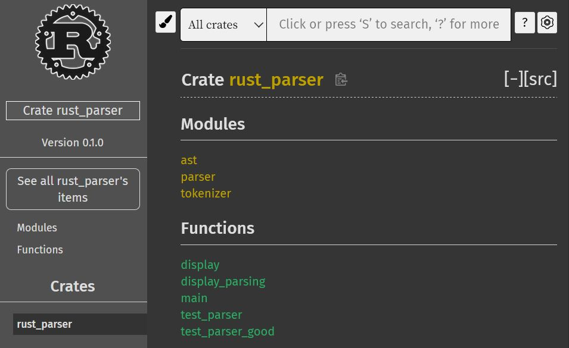
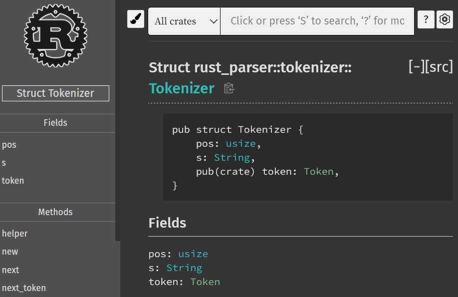
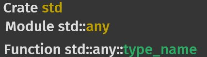
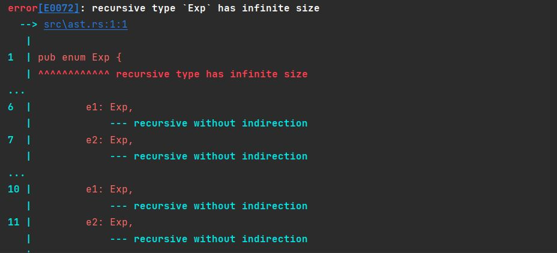
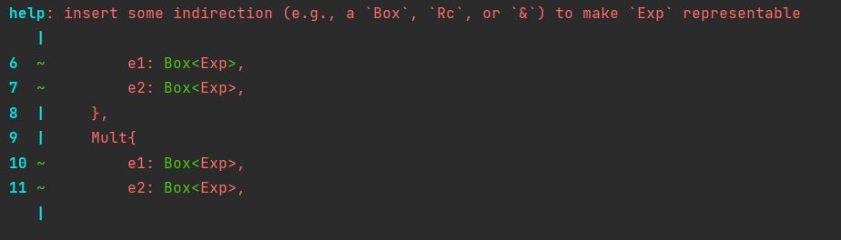
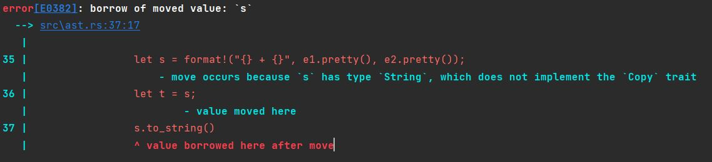

# rust-parser

## C++ vs Rust am Beispiel eines einfachen Parsers für arithmetische Ausdrücke

Der Rust-Parser basiert auf dem C++-Parser Projekt im Rahmen des Softwareprojekts 
im 2. Semester und dient dazu die Unterschiede zwischen der objektorientierten Umsetzung 
in C++ und der datenorientierten Gestaltung in Rust aufzuzeigen.
Dabei wird ein Hauptaugenmerk auf die speziellen Ownership-Rechte in Rust.

Als Einführung in die Programmiersprache-Rust habe ich 
folgende [Literatur-Quelle](https://doc.rust-lang.org/book/) benutzt, 
um mich mit den grundlegenden Besonderheiten und Unterschiede bekannt zu machen.

### Die Quelldateien:
+ **ast.rs:** Stellt einen abstrakten Syntax Baum zur Verfügung,der durch die pretty-printing Funktion in einen String umgewandelt wird
+ **tokenizer.rs:** Zerlegt den Eingabe-String in logisch zusammengehörige Einheiten, den Tokens
+ **parser.rs:** Nimmt als Input die Tokens vom Tokenizer und generiert den AST nach der definierten Grammatik
+ **main.rs:** Allgemeine Testklasse
---------
### Inhalte
1. [Grundlagen](#grundlagen)
   1. [Header und Source Files](#header-und-source-files)
   2. [Modules](#modules)
   3. [Crates](#crates)
   4. [Namensräume](#namensrume)
   5. [Package manager](#package-manager)
   
2. [Implementierung](#implementierung)
   1. [Rust Structs](#rust-structs)
      1. [self Parameter](#self)
      2. [Assoziierte Funktionen](#assoziierte-funktionen)
   2. [Vererbung](#vererbung)
      1. ["Vererbung" durch Traits](#vererbung-durch-traits)
      2. [Branch-Based Inheritance](#branch-based-inheritance)
         1. [Pattern-Matching](#pattern-matching)
   3. [Konstruktoren](#konstruktoren)
   4. [Rust Ownership](#rust-ownership)
      1. [Stack und Heap](#stack-und-heap)
      2. [Ownership Rules](#ownership-rules)
      3. [Binding](#binding)
      4. [Shallow and Deep Copy in C++](#shallow-and-deep-copy-in-c)
      5. [Move in Rust](#move-in-rust)
      6. [Borrow](#borrow)
      7. [Passing By ...](#passing-by-)
      8. [Einschub: Mutability](#einschub-mutabilty)
         1. [Veränderliche Referenz & mut](#vernderliche-referenz--mut)
         2. [Die 4 Möglichkeiten](#die-4-mglichkeiten)
      9. [Ownership in rust-parser](#ownership-in-rust_parser)
         1. [parser.rs](#parserrs)
         2. [Tokenizer Instanz innerhalb Parser Instanz](#tokenizer-instanz-innerhalb-parser-instanz)
         3. [tokenizer.rs](#tokenizerrs)
   5. [Option vs Optional](#optiont-vs-optionalt)
      1. [None](#none)
      2. [Some](#some)
      3. [Methoden](#methoden-gegenberstellung)
3. [Anderes](#anderes)
   1. [String Indexing](#string-indexing)
   2. [Type-Of](#type_of)
4. [Quellen](#quellen)
____
# Grundlagen
Als Erstes werde ich auf die grundlegenden Strukturen der Rust-Dateien, darüber hinaus auf das 
Package-Management-System Cargo eingehen und diese mit den in C++ zur Verfügung gestellten Funktionalitäten vergleichen.

## Header und Source Files
Der erste Unterschied zwischen C++ und Rust liegt in der Strukturierung der Dateien.
In C++, sowie C werden in den Header-Files (.h und .hpp) Klassen deklariert, definiert, 
Signaturen für Funktionen und auch Makros festgelegt:
```c++
typedef std::shared_ptr<Exp> EXP;

EXP newInt(int i);
EXP newPlus(EXP l, EXP r);
EXP newMult(EXP l, EXP r);
```

Die Quelldateien (.c, .cpp) können die für sie benötigten Deklarationen der Header-Files 
durch #include implementieren.

In C++ können Klassen ihre Funktionen und Felder für andere Klassen, welche von ihr erben,
sichtbar machen oder diese verstecken mit den Schlüsselwörtern public, protected und private.

* ```public``` kann intern und von jedem außerhalb der Klasse verwendet werden
* ```protected``` kann klassenintern und von Unterklassen verwendet werden
* ```private``` kann nur innerhalb der Klasse verwendet werden

Auch gibt es die Möglichkeit eine andere Klasse als "Freund" zu erlauben auf
alle privaten und geschützten Mitglieder der Klasse zuzugreifen.


Im Gegensatz dazu, können in Rust sowohl Structs (Vergleich: C++ Klassen), Funktionen 
und deren Implementierung in einer einzigen .rs Datei enthalten sein.

Auch sind die Zugriffsmodifikatoren in Rust etwas simpler.
Soll ein Struct außerhalb des Moduls sichtbar sein benutzt man das Schlüsselwort ```pub```.
Wenn nicht sind sie standardmäßig nur innerhalb des Moduls und für Submodule sichtbar.

```Rust
pub struct Tokenizer{
    pos: usize,
    s: String,
    pub token: Token
}
```
Hier am Beispiel das Äquivalent zur Tokenizer Klasse in C++. 
Die Felder pos und s sind privat. Das Feld token jedoch nicht, da die Datei parser.rs in den parser_ Funktionen 
auf das ```token``` zugreifen muss:
```rust
fn parse_e2(&mut self, left: Box<Exp>) -> Option<Box<Exp>>{
    return match self.t.token  //token muss public sein
    //...
```

## Modules
Module sind eine Ansammlung von Funktionen, Structs, Traits und Implementierungen.
Das Modul-System hilft dabei den Code in Gruppen zu strukturieren,
sowie Gültigkeitsbereiche und Datenschutz (public/ private) zu organisieren.
Andere .rs Dateien können diese Module durch ```use``` in ihre Datei einbinden, um deren Funktionalität zu nutzen.

```Rust
mod ast;
mod tokenizer;
mod parser;
```
Zur Weiteren Strukturierung des Projektes gilt zu erwähnen, dass mehrere Module eines Projektes ein Crate ergeben.

## Crates
Rust-Crates sind mit Bibliotheken oder Packages zu vergleichen wie man sie aus C++ kennt.
Sie können je nach Projekt eine geteilte Bibliothek oder ein ausführbares Programm sein, die durch den Rust Compiler
**rustc.** kompiliert werden. Jedes Crate hat implizit ein root-Modul, in der der
Compiler mit der Code-Ausführung startet.
Das Root-Modul kann wiederum in Sub-Module unterteilt werden kann, wodurch das Projekt strukturiert und organisiert werden kann.
Der **crate root** ist in unserem rust_parser die main.rs Datei mit den Modulen ast, parser und tokenizer.
Zur Veranschaulichung bietet Rust ein hilfreiches Feature das eine Dokumentation das Projekt erstellt.
```
cargo doc --open
```
<p float="left">
    
    
</p>

Dabei sind alle Bestandteile des Projektes, inklusive alle Structs, Enums,
Funktionen und deren Implementierung zu sehen.

Außerdem bietet cargo noch die Möglichkeit seine Implementierungen zu veröffentlichen mit dem Befehl:
```
cargo publish
```

Hierbei wird jedoch ein Account bei [crates.io](https://crates.io/) gebraucht (sowie ein GitHub Account),
wodurch dann mithilfe eines einzigartigen API-Tokens, ein eigenes Crate veröffentlicht werden kann.

Will man ein externes Crate nutzen, nur bestimmte Module oder Funktionen davon,
kann man diese ebenfalls mit dem Schlüsselwort ```use``` einbinden:
```rust
use std::any::type_name; //Returns the name of a type as a string slice
```

Hierbei ist std das Crate, any das Modul und [type_name](https://doc.rust-lang.org/std/any/fn.type_name.html) die Funktion.



## Namensräume
C++-Namensräume werden dazu benutzt um Funktionen, Variablen und Klassen zu gruppieren, damit der Compiler sie von anderen gleichnamigen Signaturen unterscheiden kann.
In Rust wird dies durch die Module geregelt, 
wobei jede .rs Datei implizit ein Modul ist, mit gleichem Namen wie die Datei.
Die Datei parser.rs braucht viele Funktionalitäten von tokenizer.rs: 
Zur Definition des Parser-Structs, 
Zugriff auf die helper() Funktion um einen neuen Tokenizer zuzuweisen 
und auf das Token enum um pattern-matching ausführen zu können.
Der Tokenizer (mit seiner Implementierung) und das Token enum kann
folgendermaßen inkludiert werden:
```
use crate::tokenizer::{Tokenizer, Token};
```
Allerdings besteht das ganze Modul tokenizer.rs allein aus dem Tokenizer und dem Token enum.
Deshalb ist es sinnvoll und kürzer einfach das ganze Modul zuzufügen, was mit dem Stern-Operator möglich ist:
```
use crate::tokenizer::*;
```

Von ast.rs braucht parser.rs allerdings nur das enum Exp um die 
jeweiligen arithmetischen Ausdrücke zu erzeugen.
```
use crate::ast::Exp;
```

Explizite Module sind auch möglich, werden aber in dem Projekt nicht genutzt. 
Meistens braucht man sie wenn es nicht sinnvol ist, dass die gesamte Funktionalität eines Moduls 
in eine eigene .rs Datei gepackt wird.


**Crates**, zu Deutsch "Kisten" sind wie erwähnt Bibliotheken oder Packages und können mithilfe von Rust's
Package-Manager **Cargo**, als "Fracht" verteilt werden. 


## Package manager
[Cargo](https://doc.rust-lang.org/cargo/) ist das offizielle Package-Management System
für Rust und auch wenn es für C++ viele gute Package-Manager gibt wie
beispielsweise [Conan](https://conan.io/) und
[Vcpkg](https://vcpkg.io/en/index.html) regelt Cargo das meiste für den Nutzer,
wohingegen in C++ die meisten Konfigurationen selbst in der CmakeFile
durchgeführt werden müssen.
```cargo install``` lädt die Bibliotheken,
```cargo new rust_parser``` erstellt das Projekt und
```cargo build``` baut das Projekt auf.

--------
# Implementierung
In diesem Abschnitt werde ich erst allgemein auf die Rust-Structs und deren Implementierung eingehen, 
die in jeder .rs Datei ihre Verwendung finden und danach einzeln auf 
die Quelldateien.

## Rust Structs
In C++ gibt es sowohl Klassen als auch Structs mit Feldern und Funktionen.
Dabei ist der Unterschied nicht sehr groß. Das Vererbungsprinzip gilt für beide.
Standardmäßig sind Felder in Structs public und Klassen private, können jedoch Felder und Funktionen mit 
verschiedenen Zugriffsbeschränkungen haben.

Rust hat nur Strukturen (Structs). Diese bestehen aus einer Definition, 
die die Felder, mit deren Zugriffsrecht festlegt und für die anschließend mit dem Schlüsselwort
```impl ``` Funktionen implementiert werden können.

### self 
Beim Implementieren von Structs durch ```impl``` ist ```self``` der erste Parameter der in Funktionen verwendet wird.
Das Schlüsselwort ```self``` ist zu vergleichen mit ```this``` in C++.
Durch den Punktoperator können wir mithilfe von [self](https://doc.rust-lang.org/std/keyword.self.html) auf die Felder des Structs
zugreifen.

### Assoziierte Funktionen
Alle Funktionen die innerhalb des ```impl``` Blocks gefasst werden, sind assoziiert, da sie dem
nach dem ```impl``` Block benannten Typ zugeordnet sind.

In C++ wurde eine Basis-Klasse für die Expressions Exp definiert, von der dann 
IntExp, PlusExp und MultExp erben und durch ihre Felder val bzw. e1 und e2 erweitern.

Diese benutzerdefinierten Datentypen können in Rust jeweils als Struct 
zusammengefasst werden:

```rust
pub struct Int {
    pub val: i32
}

pub struct Plus<T:Exp> {
    pub e1: T,
    pub e2: T
}

pub struct Mult<T:Exp> {
    pub e1: T,
    pub e2: T
}
```
## Vererbung
Um die Vererbung der Tokenizer Klasse in C++ von der Klasse Tokenize und wiederum die Vererbung
der Parser Klasse von der Tokenizer Klasse zu simulieren gibt es verschiedene Möglichkeiten.
"Simulieren" deswegen, weil es in Rust keine Vererbung gibt, wie man es aus C++ oder Java kennt.
Es ist nicht möglich Felder eines Structs zu erweitern.

### "Vererbung" durch Traits
Das nächste, was eine Vererbung wie in den objektorientierten Sprachen simulieren kann, sind 
die sogenannten Traits, die den in Java vorhandenen Interfaces ähneln.

Mit Traits können Funktionen für bestimmtes Verhalten definiert werden. 
Im rust-parser könnte man die Funktionen zum evaluieren (eval()) und 
pretty_printing (pretty()) in einem Trait Exp zusammenfassen.

Die Structs Int, Plus und Mult können dieses Verhalten aufnehmen oder "erben" 
und durch ```impl ... for``` anpassen.

```rust
pub trait Exp {
    fn eval(&self) -> i32;
}

pub struct Int {
    pub val: i32
}

pub struct Plus<T:Exp> {
    pub e1: T,
    pub e2: T

}

impl Exp for Int {
    fn eval(&self) -> i32 {
        return self.val
    }
}

impl<T:Exp> Exp for Plus<T> {
    fn eval(&self) -> i32 {
      return self.e1.eval() + self.e2.eval()
    }

    //...
    
}
```
Bei Rust handelt es sich um eine statisch typisierte Sprache, 
bei der der Typ jeder Variable bei der Kompilierung bekannt sein muss.

Normalerweise werden alle Werte auf dem Stack allokiert, da sie statisch 
und damit bekannt sind. Um dennoch Rückgaben zu realisieren, die zur Laufzeit unbekannt gibt es das "Boxed"
Modell. ```Box<T>``` ist eine Art Smart Pointer der Heap-Speicher für den
generischen Typ ```T``` allokiert. 
Für die parser_ Funktionen wäre somit der Rückgabetyp das Exp-Trait: ```Option<Box<dyn Exp>>```
Das Schlüsselwort ```dyn``` steht für **dynamic** und ist nicht unbedingt notwendig.
Jedoch wird im
[RFC-2113 Standard](https://github.com/rust-lang/rfcs/blob/master/text/2113-dyn-trait-syntax.md)
folgender Grund für die Notwendigkeit angegeben:

> "impl Trait is going to require a significant shift in idioms 
and teaching materials all on its own, and “dyn Trait vs impl Trait” 
is much nicer for teaching and ergonomics than “bare trait vs impl Trait”"

Der Speicher wird automatisch durch den Destruktor
wieder freigegeben, wenn die Scope in der die Box definiert wurde verlassen wird.

### Branch-Based Inheritance
Für den rust-parser reicht jedoch eine Branch-basierte Umsetzung der Exp-Vererbung.
In Rust gibt es wie in C++ Enumerationen (enums). Wird ein Enum nun als Rückgabetyp 
festgelegt, ist zwar noch immer unbekannt welches der Enum-Varianten am Ende zurückgegeben wird, es ist jedoch
klar, eines davon wird zurückgegeben. Deswegen wird soviel Speicher allokiert wie die 
größte Enum-Variante benötigt. Daher muss auch der Rückgabetyp nicht mehr in ```Box``` eingehüllt werden. 

```rust
pub enum Exp {
    Int {
        val: i32,
    },
    Plus {
        e1: Box<Exp>,
        e2: Box<Exp>,
    },
    Mult{
        e1: Box<Exp>,
        e2: Box<Exp>,
    },
}
```
Die Instanziierung der Expressions findet an folgenden Stellen statt:
```rust
fn parse_e2(&mut self, left: Box<Exp>) -> Option<Exp> {
    //...
    Parser::parse_e2(self, Exp::Plus { e1: Box::from(left), e2: Box::from(right.unwrap()) })
    //...
}
fn parse_t2(&mut self, left: Box<Exp>) -> Option<Exp> {
    //...
    Parser::parse_t2(self, Exp::Mult { e1: Box::from(left), e2: Box::from(right.unwrap()) })
    //...
}
fn parse_f(& mut self) -> Option<Exp> {
    return match &self.t.token {
        Token::ZERO => {
            //...
            Some(Exp::Int { val: 0 })
        }
        //... same for Token::ONE and Token::TWO
    }
}
```
Bei der Instanziierung von Plus und Mult ist ```Box``` allerdings notwendig, denn 
würde man die Structs folgendermaßen konstruieren:
```rust
pub enum Exp {
    Int {
        val: i32,
    },
    Plus {
        e1: Exp,
        e2: Exp,
    },
    Mult{
        e1: Exp,
        e2: Exp,
    },
}
```
würde das theoretisch funktionieren wenn man unbegrenzten Speicher hätte.
Doch der Compiler warnt uns zu recht:



Um zu bestimmen wie viel Speicher für einen Exp-Ausdruck gebraucht wird, geht Rust durch
jede Möglichkeit durch und richtet sich nach der Variante, die am meisten Speicher braucht.
Für Int ist das kein Problem, denn wir definieren, dass wir lediglich soviel Platz für
die größt mögliche 32bit-Integer brauchen. 
Bei Plus und Mult sieht das anders aus.
Denn durch diese Definition würde man für jede mögliche Kombination Speicher brauchen.
Da man endlos Ausdrücke innerhalb Ausdrücke haben kann, würde 
Exp aufgrund der Rekursion eine unendliche Größe brauchen. 

Zum Glück wird uns ein hilfreicher Hinweis gegeben:



Es wird vorgeschlagen eine "Indirection" zu nutzen. Das bedeutet, wir speichern
den Wert nicht direkt, sondern speichern einen Pointer. Da die Größe eines Pointers
von der Größe der Daten auf die sie zeigt, unabhängig ist, 
löst Box das Problem des unendlichen, rekursiven Speichers.


Die Implementierung der eval() und pretty() Funktionen ändert sich leicht.
Da nun als Rückgabe einer der drei Enum-Varianten Int, Plus oder Mult entstehen kann,
wird ein pattern-matching durchgeführt um herauszufinden welche der eval() und pretty() Funktionen
gebraucht wird:

```rust
impl Exp {
    pub fn eval(self: &Exp) -> i32 {
        return match self {
            Exp::Int { val } => *val,
            
            Exp::Plus { e1, e2 } => {
                e1.eval() + e2.eval()
            },
            
            Exp::Mult { e1, e2 } => {
                e1.eval() * e2.eval()
            }
        }
    }
    //...pretty
}
```
### Pattern-Matching
```Match``` ähnelt dem Switch-Case Statement von C++. Genau wie bei switch-case
wird eine Variable mit einer Menge von bekannten Wert-Möglichkeiten verglichen 
und je nach Ergebnis ein spezifischer Code ausgeführt. Beide haben einen Default-Fall.
In C++ gekennzeichnet mit ```default:``` und in Rust mit ```__ => {}```
Das Return kann im pattern-matching ausgeklammert werden.

Rust's pattern-match geht jedoch noch weiter. **switch** Statements können nur
numerische oder boolesche Werte vergleichen, doch **match** funktioniert sowohl mit
Integer und booleschen Werten, als auch mit weiteren Enums, Tupeln, Arrays und 
eigenen Structs.

In diesem Fall gibt es eine eval()-Funktion mit einer Exp-Referenz als Eingabe-Paramter,
welcher mit allen Fällen verglichen wird und die passende Rückgabe liefert.

Im parser.rs wird in der main.rs das pattern-match initiiert:
```rust
fn display(e: Option<Exp>){
    if e.is_none() {
        println!("nothing \n");
    }
    else{
        let str: String = e.unwrap().pretty() + "\n"; // e bestimmt pretty()-Rückgabe
        println!("{}", str);
    }
}
```
Die display()-Funktion bekommt den ast vom Parser. pretty() nimmt als Parameter self entgegen.
Jede Funktion, die ein (mut) self oder &(mut) self als Parameter besitzt, kann von der an die 
Struktur gebundene Variable mit dem Punktoperator aufgerufen werden.
Variable ```e``` entspricht daher dem
```self``` im pattern-matching und gibt den passenden geklammerten oder ungeklammerten Ausdruck zurück.

## Konstruktoren
In C++ gibt es zwei Klassen: Zum einen die Tokenize Klasse mit den Feldern pos für die Position und s für 
den String, welcher in Tokens zerlegt werden soll. Zum Anderen die Tokenizer Klasse, die von Tokenize erbt 
und sie um das Feld token erweitert. 
In Rust können diese zwei Klassen in einem Struct zusammengefasst werden:

```rust
pub struct Tokenizer{
    pos: usize,
    s: String,
    pub token: Token
}
```
Anschließend folgt durch ```impl``` ein Code-Block in der man die zugehörigen Funktionen binden kann.
Wie vorher erwähnt sind alle Funktionen innerhalb des Blocks assoziiert und haben typischerweise als ersten Parameter
das Schlüsselwort ```self```. Es kann jedoch auch Funktionen innerhalb geben ohne self-Parameter. Diese sind dann nur Funktionen 
und nicht Methoden.

* Funktionen: Code, der durch ihren Namen aufgerufen wird
* Methoden: Code, der durch ihren Namen aufgerufen wird und mit einem Objekt (hier dem Struct) assoziiert wird.

Assoziierte Funktionen ohne self-Parameter werden oft als Konstruktoren benutzt, die eine neue Instanz des Structs zurückgeben:
```rust
impl Tokenizer {
    pub fn new(text: &str) -> Tokenizer { //
        Tokenizer {
            pos: 0,
            s: text.parse().unwrap(),
            token: Token::DEFAULT
        }
    }
    
    //...
}
```
Diese new()-Funktion ist meist optional und eher zur Vereinfachung der Instanziierung gedacht.
In Rust muss nämlich kein Konstruktor definiert werden.
Möchte man einen neuen Tokenizer erstellen könnte man das auch direkt ohne Methodenaufruf machen,
indem man die Felder des Tokenizers einen Wert zuweist.

```rust
let token = Tokenizer{pos:0, s: "1 + 0", Token::DEFAULT }
```

Damit gibt es in Rust eine Art impliziten Konstruktor für jedes Structs mit Feldern.
Ein Unterschied zu C++ ist allerdings, dass der Konstruktor nicht überladen werden kann.
Braucht man mehrere Konstruktoren (z.B. einmal ohne und einmal mit (mehreren) Parameter) ist es notwendig auch mehrere new() 
Funktionen zu haben, die sich im Namen unterscheiden. 

Die direkte Instanziierung macht in unserem rust-parser an der Stelle keinen Sinn, denn der Tokenizer
wird nur einmal als Struct-Feld im Parser benötigt. 
Schauen wir uns den C++ Code an:
```c++
class Tokenizer : Tokenize {
public:
    Token_t token;
    Tokenizer(string s) : Tokenize(s) { token = next(); }
    void nextToken() {
        token = next();
    }
};
```
Variable token bekommt seine erste Zuweisung bereits im Konstruktor durch die next() Funktion.
In Rust ist das nicht so einfach umzusetzen, da das Prinzip des Ownerships spezielle Betrachtung erfordert.

## Rust Ownership
Die sogenannte Eigentümerschaft (Ownership) ist wohl das Merkmal von Rust, dass die 
Programmiersprache von anderen abhebt. Aufgrund dieses Merkmals wird Rust auch als
eine "Typsichere" Sprache bezeichnet. Das bedeutet, dass der Compiler sicherstellt, dass jedes 
Programm ein wohldefiniertes Verhalten hat. Das Besondere daran ist, dass Rust dafür
weder einen Garbage Collector wie Java noch eine manuelle Speicherverwaltung wie in C/C++ braucht. 

### Stack und Heap
In Rust kann Speicher wie in C++ auf dem Heap oder Stack allokiert werden.
Als kurze Wiederholung hier der Unterschied zwischen Stack und Heap:

**Stack:**
* LIFO (Last in First Out) Prinzip
* Speichert Daten die zur Compile-Zeit bekannt sind

**Heap:**
* Dynamische Speicherung von veränderlichen Daten
* Weniger organisierter Speicher 
* Speichert Daten die zur Compile-Zeit unbekannt sind

### Ownership Rules
1. Wenn ein Wert einer Variable zugewiesen wird, ist diese Variable der Eigentümer des Wertes
2. Ein Wert kann nur einen Eigentümer haben (Ausnahmen mit Shared Ownership std::Rc)
3. Verlässt der Eigentümer den Gültigkeitsbereich {}, wird der Wert gelöscht

### Binding
Das Zuweisen eines Wertes zu einer Variablen wird als "Binding" bezeichnet. Der 
Wert wird an die Variable gebunden und "besitzt" ihn nun und das so lange, bis
die Variable aus dem Gültigkeitsbereich geht. Dann wird der Speicher der Variable 
freigegeben. 

Regel 2. bedeutet daher, dass zwei Variablen nicht auf den gleichen Wert zeigen dürfen.
Denn sonst würde es mehrere Besitzer geben.
Versucht man dies trotzdem, könnte man (je nach Datentyp) einen Kompilier-Fehler bekommen.

Dies gilt nur für Variablen, die nicht das Copy-Trait implementieren.
Durch Copy wird eine exakte Kopie des Wertes angelegt und an die andere 
Variable gebunden. Numerische Werte implementieren Copy implizit. 
```rust
pub fn eval(self: &Exp) -> i32 {
    return match self {
        Exp::Plus { e1, e2 } => {
            let x = e1.eval() + e2.eval();
            let y = x;
            x;
        }
        //...
    }
}
```
Deswegen kann x weiterverwendet werden, da der Wert in x lediglich nach y kopiert wurde 
und beide Variablen Besitzer ihres jeweiligen Wertes sind.

Datentypen wie Vektoren, Strings oder eigene Structs müssten das Copy-Trait explizit
implementieren.
Wenn man trotzdem versucht eine Variable einer anderen zuzuweisen, kann nur noch 
die neue Variable verwendet werden, da die Eigentümerschaft übertragen wurde.

```rust
Exp::Plus { e1, e2 } => {
                let s = format!("{} + {}", e1.pretty(), e2.pretty());
                let t = s;
                s.to_string()
            }
```
Obwohl im Code optisch gesehen das gleiche wie oben angewandt wird, kommt es zu diesem Fehler:



### Shallow and Deep Copy in C++
In C++ würde diese Zuweisung funktionieren, da eine **Shallow Copy** durchgeführt werden würde.
Die Variablen s und t beziehen sich zu Beginn auf unterschiedliche Speicherbereiche.
Wenn s der Variablen t zugewiesen wird, beziehen sich die beiden Variablen auf denselben Speicherbereich, da nur der 
Pointer kopiert wurde. 
Änderungen an einer der beiden Variablen würden sich die Inhalte der jeweilig anderen Variablen auswirken,
da sie auf die gleiche Speicherstelle zeigen.

Die **Deep Copy** würde der Implementation des Copy-Traits in Rust entsprechen. 
Die Variablen s unt t zeigen auf verschiedene Speicherbereiche. Wenn s der Variablen t zugewiesen wird,
werden die Werte aus dem Speicherbereich, auf den s zeigt, in den Speicherbereich kopiert, auf den t zeigt.
Spätere Änderungen an einer der beiden Variablen bleiben eindeutig, da der Speicher 
nicht geteilt wird.

### Move in Rust
Aufgrund des Ownerships in Rust, können zwei Variablen nicht auf den gleichen Speicher zeigen.
Nach der Zuweisung ist die neue Variable t nun Eigentümer des Wertes, der ursprünglich in s stand.
Es kommt zu einem Kompilier-Fehler, da man versucht einen Wert zurückzugeben,
welcher in eine andere Variable (t) verschoben wurde. Daher spricht man von einem ```move```

Damit wird auch das Problem in C++ umgangen, versehentlich zweimal denselben Speicher freizugeben.
Wenn nur eine Variable valide ist, wird nur einmal der Speicher freigegeben, wenn diese 
den Gültigkeitsbereich verlässt.


Schwieriger wird es, wenn die Verschiebung nicht mehr so auffällig ist. 
Besonders bei Funktionsaufrufen muss darauf geachtet werden, nicht ausversehen
das Besitzrecht abzugeben, wenn man die Variable später noch verwenden will.

Es ist auch nicht immer sinnvoll für Vektoren, Strings oder eigene Structs das Copy-Trait
zu implementieren, das das Kopieren von Speicher Ressourcen-aufwändig ist.
Dafür bietet Rust an, das Besitzrecht auszuleihen.

### Borrow
Wie oben gesehen, kann ein Wert (der nicht Copy implementiert), nicht einer anderen
Variablen zugewiesen und danach weiter benutzt werden. 
Jedoch kann man mit ```&``` den Wert an eine Variable oder als Argument an eine
Funktion als **Referenz** ausleihen. 
Eine Variable, die nun eine Referenz auf einen Wert enthält, kann wiederum ohne 
vorangestellten ```&``` Operator an Funktionen übergeben werden oder wieder an 
andere Variablen. Diese Zuweisungen funktionieren, weil Referenzen auch das Copy-Trait 
[implementieren](https://stackoverflow.com/questions/41413336/do-all-primitive-types-implement-the-copy-trait).

### Passing By ... 
**Als Wert übergeben (Passing by value)**
* Wert implementiert Copy-Trait und wird nicht ausgeliehen
* Wert ist eine Referenz, welche das Copy-Trait implementiert 

**Als Referenz übergeben (Passing by Reference)**
* Wert implementiert Copy-Trait und wird ausgeliehen
* Wert implementiert nicht Copy-Trait und muss ausgeliehen werden

In den Signaturen der parse_ Funktionen ist immer zu Beginn der Parameter 
```& mut self``` zu sehen. Es wird also eine Referenz ```&``` auf die 
Datenstruktur des Parsers ```self``` übergeben. 
Ohne das Schlüsselwort ```mut``` würde man eine solche Referenz übergeben, um
die Daten in dem Struct zu lesen.

### Einschub: Mutabilty
Jedoch möchte man häufig die Daten des Structs verändern, neu zuweisen, überschreiben, etc.
In Rust ist nicht möglich so eine Einfache Überschreibung wie hier zu machen:
```rust
let x = 5;
x = 6;
```
In Rust, sind Variablen Default-mäßig unveränderlich (immutable).
Um eine Variable oder Daten im Struct veränderlich zu machen muss dies durch ```mut``` explizit 
angegeben werden.
```rust
let mut x = 5;
x = 6;
```

#### Veränderliche Referenz & mut
Die Veränderlichkeit von Variablen hat insofern etwas mit der Eigentümerschaft zu tun,
dass man einer Funktion erlaubt, den ausgeliehenen Wert (die Referenz) zu verändern.
```& mut self``` als Parameter in den parse_ Funktionen bedeutet daher:
Man übergibt der Funktion eine Referenz, die die Felder der Datenstruktur Parser
verändern darf, ohne die Eigentümerschaft abzugeben.
```& mut self``` ist die Kurzform für ```self: & mut Self```.
Self wiederum, ist ein Alias für den Typ, welcher vom ```impl``` Block implementiert wird

#### Die 4 Möglichkeiten: 
* **self:** immutable move
* **mut self:** mutable move
* **&self:** immutable borrow
* **&mut self:** mutable borrow

### Ownership in rust_parser
#### parser.rs
Zunächst mal muss auf jeden Fall die parse_f Funktion eine veränderbare Referenz auf 
die Parser Instanz bekommen, da sie das Feld t, welches den Tokenizer enthält für
den aktuellen Token auslesen muss.

Funktionen parse_e2 und parse_t2 brauchen ebenfalls ```& mut self``` als Parameter,
da im Fall: Token war ein Plus (parse_e2) oder Token war ein Mult (parse_t2),
das ```token``` Feld der Tokenizer Instanz das Token des Strings auslesen muss.

Da man zur Compile-Zeit aber nicht weiß, welcher Weg durch die rekursiven Aufrufe 
zum Bau der ast-Struktur eingeschlagen wird, müssen alle anderen parse_ Funktionen
ebenfalls ```&mut self``` als ersten Parameter enthalten. 
Das Besitzrecht für die Instanz wird quasi bis an die parse_f Funktion durchgereicht.

#### Tokenizer Instanz innerhalb Parser Instanz
Kompliziert wurde es mit dem Besitzrecht in der Konstruktor-ähnlichen 
new()-Funktion im tokenizer.rs. 
Die Parser Datenstruktur hat als einziges Feld einen Tokenizer. 
```rust
pub struct Parser {
    t: Tokenizer
}
```
Versucht man direkt den Tokenizer zu instanziieren stößt man zuerst auf das Problem,
dass die Felder des Tokenizers public sein müssen. Das ist schnell gelöst, indem 
den Tokenizer Felder einfach ein ```pub``` vorangestellt wird.

Dazu kommt jedoch, dass das Feld token der Datenstruktur Tokenizer seinen ersten Token durch die next() Funktion bekommt.
Da next() auf die Datenfelder sowohl lesend (für den String) 
als auch schreibend (für die Position pos) zugreift, muss self veränderlich 
ausgeliehen werden.

```rust
impl Parser {
    pub fn new(string_to_parse: &str) -> Parser {
        Parser {
            t: Tokenizer {
                pos: 0,
                s: string_to_parse.to_string(),
                token: Tokenizer::next(&mut self.t)
            }
        }
    }
    //...
}
```
Das bedeutet aber, dass die new-Funktion selbst eine veränderliche self-Referenz braucht,
um sie next() ausleihen zu können. Die Signatur würde sich ändern zu:
```rust
pub fn new(&mut self, string_to_parse: &str) -> Parser{ //...}
```

Und jetzt würde sich das Problem in die main.rs verschieben, da nun bei 
jeder Instanziierung eines Parsers ein self gebraucht wird.

Also muss bei der display-parsing() Funktion auch wieder ein
```&mut self``` Parameter zugefügt werden, damit dieser beim
Aufruf der new() Funktion ausgeliehen werden kann.
```rust
fn display_parsing(&mut self,to_parse: &str) {
    let parser = parser::Parser::new(self,to_parse).parse();
    display(parser);
}
```
Hierbei bekommt man schon die Warnung:
"The keyword self was used in a static method"

Und bei der Ausführung die Fehlermeldung [E0424](https://doc.rust-lang.org/error-index.html#E0424):


self kann nämlich nur in Methoden (assoziierte Funktionen) die sich innerhalb eines
```impl``` Blocks auf den zu implementierenden Typ beziehen, verwendet werden.
In main.rs gibt es nichts, worauf sich self beziehen kann.

#### tokenizer.rs
Um dieses Problem zu umgehen, gibt es die **helper()** Funktion in tokenizer.rs.
Diese ist ebenfalls keine Methode, da sie nur den zu parsenden String und kein self entgegennimmt.

Sie ruft für uns die new-Funktion aus, die als Konstruktor dient und unseren Tokenizer
mit dem zu parsenden-String und den Default-Werten für die Position ```pos ``` und den Token ```token```
auffüllt. Aus diesem Grund musste auch ein DEFAULT-Token zugefügt werden, der in der C++ Variante nicht vorhanden war.

```rust
impl Tokenizer {
    pub fn new(text: &str) -> Tokenizer { //
        Tokenizer {
            pos: 0,
            s: text.to_string(),
            token: Token::DEFAULT
        }
    }
    //...
}

```
helper() erstellt also erst einen Tokenizer. 
Dieser Tokenizer ```t``` kann dann einfach veränderlich an die next() Funktion ausgeliehen werden,
um dann nachträglich den ersten Token zuzuweisen.

```rust
pub fn helper(text: &str)->Tokenizer{
        let mut t = Tokenizer::new(text);
        t.token = Tokenizer::next(&mut t);
        return t;
    }
```
Somit sorgt sie dazu, dass der Parser nicht direkt den Tokenizer instanziieren muss und 
damit die Besitzrecht-Konflikte für den Parameter self nicht auftauchen.


### Option<T> vs Optional<T>
#### None
#### Some
#### Methoden (Gegenüberstellung)


____
###Anderes
In diesem letzten Abschnitt greife ich noch weitere Besonderheiten von Rust auf, die mir im Laufe der
Projektarbeit begegnet sind und nicht zu den Hauptthemen passten.

####String Indexing
In C++ ist es möglich einen String zu indexieren, was innerhalb der next() Methode verwendet wird, 
um die Position des aktuellen Characters im Eingabe-String zu erhöhen.
```c++
Token_t Tokenize::next() {
    //...
    while(1) {
        //...
        switch(s[pos]) {
            //...
        }
    }
}
```
In Rust ist diese einfache Schreibweise nicht übertragbar, da Indexierung von String nicht möglich ist.
Der Grund dafür, liegt dabei, dass intern Rust-Strings in UTF-8 kodiert sind und nicht in ASCII.
UTF-8 ist eine Kodierung mit variabler Länge für Unicode-Zeichen. Da sie variabel ist, kann die Speicherposition
des n-ten Zeichens nicht bestimmt werden, ohne den gesamten String zu durchlaufen.

Als Workaround in Rust könnte man deshalb den String in einen Vektor kopieren und anschließend diesen zur
Indexierung nutzen:
```rust
    pub fn next(&mut self) -> Token {
    //...
    let my_vec: Vec<char> = self.s.chars().collect(); //Rust doesn't allow String indexing // self verbraucht

    loop {
        match my_vec[self.pos] {
            //...
        }
    }
}
```


#### Vorteile
Ein Vorteil einer zum großteil statischen Sprache ist, dass die meisten Variablen
auf dem Stack gespeichert werden und damit der Zugriff darauf schneller ist.
* sicherer
####C++ shared Pointer
####type_of 


### Quellen
[String-Indexierung](https://stackoverflow.com/questions/24542115/how-to-index-a-string-in-rust/44081208)

https://depth-first.com/articles/2020/01/27/rust-ownership-by-example/
https://stackoverflow.com/questions/59018413/when-to-use-self-self-mut-self-in-methods
https://doc.rust-lang.org/book/ch05-03-method-syntax.html
https://locka99.gitbooks.io/a-guide-to-porting-c-to-rust/content/features_of_rust/structs.html
